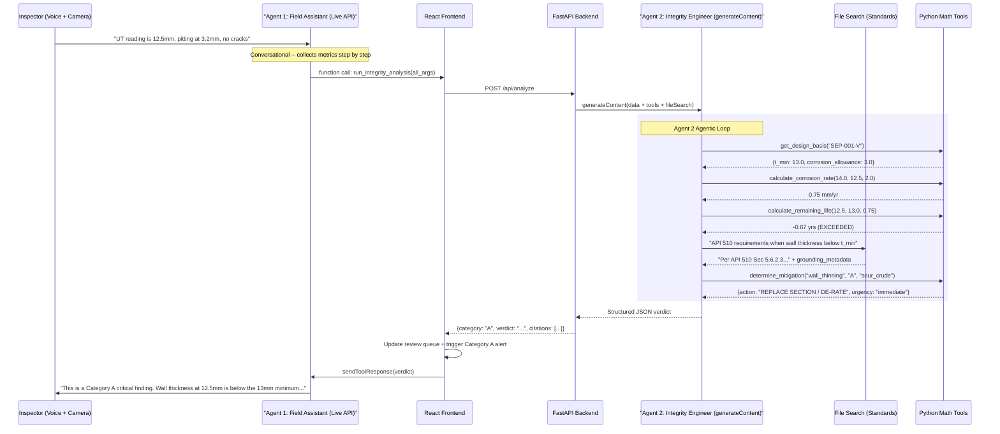

# FieldSight AI -- Hackathon Demo Plan

## Guiding Principle

Ship a **working, impressive demo** that showcases multi-agent orchestration on Google Cloud. Cut everything that doesn't contribute to the demo experience.

**What makes this impressive:**

- Talk to an AI inspector assistant via voice while pointing your camera at equipment
- Watch it delegate to a second AI agent that crunches real engineering math + cites real standards
- See real-time verdicts stream in with Category A alerts that lock the screen

**What we cut for hackathon:**

- No Docker, no PostgreSQL, no Alembic -- in-memory Python dicts for state
- No PWA service worker -- just responsive CSS
- No PDF reports -- JSON structured output is the demo
- No user auth -- single inspector assumed
- Minimal component decomposition -- keep `App.tsx` working, refactor what matters

---

## Google Cloud Technologies Showcased

- **Gemini Live API** -- real-time multimodal voice + video (Agent 1)
- **Gemini generateContent with function calling** -- agentic loop (Agent 2)
- **Gemini File Search API** -- managed RAG with auto-citations, zero vector DB infra
- **Gemini Embeddings** (gemini-embedding-001) -- powers File Search indexing automatically
- **Structured Output** -- JSON schema-compliant responses from Agent 2

---

## Multi-Agent Architecture




### Why Two Agents?

- **File Search is NOT supported in the Live API** -- Agent 2 runs via `generateContent` which supports it
- **Separation of concerns** -- Agent 1 is warm and conversational; Agent 2 is the cold, precise engineering authority
- **Deterministic math** -- Agent 2 calls Python functions as tools (function calling); it decides when to calculate but never does the math itself
- **Auditability** -- Agent 2's entire reasoning chain (tool calls + citations) is captured server-side

---

## Phase 1: Backend + Agent 2

**Goal:** Lightweight FastAPI server with the Integrity Engineer agent and deterministic tools.

### 1A. Project Layout

Keep the existing frontend in place (no monorepo restructuring). Add `backend/` alongside.

```
fieldsightai/
  src/                    # existing frontend (stays in place)
  backend/
    requirements.txt      # fastapi, uvicorn, google-genai, python-dotenv
    app/
      __init__.py
      main.py             # FastAPI app, CORS, routes
      config.py           # env vars via python-dotenv
      agents/
        integrity_engineer.py   # Agent 2 system prompt + agentic loop
      integrity/
        engine.py          # 5 deterministic Python functions
        standards.py       # mitigation lookup tables
      rag/
        store_manager.py   # File Search store CRUD
    data/
      standards/           # seed docs (API 510, ISO 4628, DNV, SOP)
    scripts/
      seed_stores.py       # one-time: create stores + upload docs
```

### 1B. Asset Registry ([backend/app/integrity/assets.py](backend/app/integrity/assets.py))

A central in-memory registry that serves both the frontend dropdown and Agent 2's tools. Each asset has descriptive info (for the inspector) and engineering specs (for Agent 2).

```python
ASSET_REGISTRY = {
    "SEP-001-V": {
        "asset_id": "SEP-001-V",
        "name": "1st Stage Separator",
        "component_type": "Pressure Vessel Shell",
        "location": "Topside Module 3, Deck A",
        "service_fluid": "Sour Crude (H2S)",
        "design_pressure_bar": 15.0,
        "design_temp_c": 85.0,
        "t_min_mm": 13.0,
        "corrosion_allowance_mm": 3.0,
        "material": "SA-516 Gr.70",
        "year_installed": 2018,
        "last_inspection": "2025-01-15",
    },
    "TK-02": {
        "asset_id": "TK-02",
        "name": "Produced Water Storage Tank",
        "component_type": "Atmospheric Storage Tank",
        "location": "Hull Compartment 7, Port Side",
        "service_fluid": "Produced Water",
        "design_pressure_bar": 1.0,
        "design_temp_c": 60.0,
        "t_min_mm": 14.0,
        "corrosion_allowance_mm": 2.5,
        "material": "SA-283 Gr.C",
        "year_installed": 2016,
        "last_inspection": "2024-11-20",
    },
    "HX-003": {
        "asset_id": "HX-003",
        "name": "Gas/Gas Heat Exchanger",
        "component_type": "Shell & Tube Heat Exchanger",
        "location": "Topside Module 2, Deck B",
        "service_fluid": "High Pressure Gas",
        "design_pressure_bar": 25.0,
        "design_temp_c": 120.0,
        "t_min_mm": 10.0,
        "corrosion_allowance_mm": 2.0,
        "material": "SA-516 Gr.70",
        "year_installed": 2019,
        "last_inspection": "2025-03-10",
    },
}

HISTORICAL_READINGS = {
    "SEP-001-V": {
        "previous_thickness_mm": 14.0,
        "previous_date": "2025-01-15",
        "previous_pit_depth_mm": 1.5,
        "previous_coating_grade": 2,
    },
    "TK-02": {
        "previous_thickness_mm": 15.2,
        "previous_date": "2024-11-20",
        "previous_pit_depth_mm": 0.5,
        "previous_coating_grade": 1,
    },
    "HX-003": {
        "previous_thickness_mm": 11.5,
        "previous_date": "2025-03-10",
        "previous_pit_depth_mm": 1.0,
        "previous_coating_grade": 2,
    },
}
```

The `GET /api/assets` endpoint returns the registry as a list (the frontend populates the dropdown). When the inspector selects an asset, the descriptive info (name, location, service fluid) is injected into Agent 1's session context. Agent 2's `get_design_basis` and `get_historical_thickness` tools read from this same registry.

### 1C. Deterministic Python Tools ([backend/app/integrity/engine.py](backend/app/integrity/engine.py))

Five functions that Agent 2 can call via function calling. The agent decides the order.

```python
def calculate_corrosion_rate(t_prev: float, t_curr: float, delta_t: float) -> dict:
    rate = (t_prev - t_curr) / delta_t if delta_t > 0 else 0.0
    return {"corrosion_rate_mm_per_year": round(rate, 4)}

def calculate_remaining_life(t_curr: float, t_min: float, corrosion_rate: float) -> dict:
    if corrosion_rate <= 0:
        return {"remaining_life_years": "infinite", "status": "stable"}
    life = (t_curr - t_min) / corrosion_rate
    return {"remaining_life_years": round(life, 2), "status": "exceeded" if life < 0 else "ok"}

def determine_mitigation(defect_type: str, category: str, environment: str) -> dict:
    # Lookup from standards.py tables

def get_design_basis(asset_id: str) -> dict:
    # Reads from ASSET_REGISTRY, returns t_min, corrosion_allowance, etc.

def get_historical_thickness(asset_id: str) -> dict:
    # Reads from HISTORICAL_READINGS, returns previous readings + date
```

### 1D. Agent 2 Runner ([backend/app/agents/integrity_engineer.py](backend/app/agents/integrity_engineer.py))

System instruction optimized for precision and citations:

```
You are a Senior Integrity Engineer (API 510 / ISO 4628 Certified).
You MUST use the provided tools for ALL calculations -- never compute numbers yourself.
You MUST cite specific standard sections from File Search results.

Given inspection data, follow this workflow:
1. get_design_basis -- retrieve t_min and corrosion allowance
2. get_historical_thickness -- retrieve previous readings
3. calculate_corrosion_rate -- compute degradation rate
4. calculate_remaining_life -- compute time to failure
5. Use File Search to find the relevant standard section for the defect type
6. determine_mitigation -- get the prescribed action
7. Return your final structured verdict
```

The agentic loop:

- Call `client.models.generate_content()` with both `function_declarations` and `file_search` in the tools array
- If response has function calls: execute the matching Python function, append results, call again
- Repeat until response is a final text/JSON verdict (no more function calls)
- Extract `grounding_metadata` for citations
- Return structured result

### 1E. FastAPI Routes ([backend/app/main.py](backend/app/main.py))

Three routes for the demo:

- `POST /api/analyze` -- receives inspection data, runs Agent 2 loop, returns verdict
- `GET /api/assets` -- returns the full asset registry list (frontend populates dropdown + shows asset details)
- `GET /api/health` -- simple health check

CORS configured to allow the Vite dev server origin.

Update [vite.config.ts](vite.config.ts) to proxy `/api` to `http://localhost:8000`.

---

## Phase 2: File Search Stores

**Goal:** Seed standards into Gemini File Search so Agent 2 has real documents to cite.

### 2A. Seed Documents ([backend/data/standards/](backend/data/standards/))

Create representative standard excerpts for the demo:

- `api_510_pressure_vessel_inspection.txt` -- wall thinning criteria, repair thresholds, inspection intervals
- `iso_4628_coating_assessment.txt` -- coating grade definitions (1-5), failure criteria
- `dnv_rp_c101_corrosion_protection.txt` -- offshore corrosion allowances, cathodic protection
- `company_sop_fpso_inspection.txt` -- company-specific procedures, safety escalation matrix

These are realistic excerpts (not full copyrighted standards) with the key sections Agent 2 needs to cite.

### 2B. Store Manager ([backend/app/rag/store_manager.py](backend/app/rag/store_manager.py))

Thin wrapper around the `google-genai` Python SDK:

```python
from google import genai

def create_or_get_store(client, display_name: str):
    for store in client.file_search_stores.list():
        if store.display_name == display_name:
            return store
    return client.file_search_stores.create(config={"display_name": display_name})

def upload_and_wait(client, store_name, file_path, metadata=None):
    op = client.file_search_stores.upload_to_file_search_store(
        file=file_path,
        file_search_store_name=store_name,
        config={"display_name": Path(file_path).name, "custom_metadata": metadata or []}
    )
    while not op.done:
        time.sleep(3)
        op = client.operations.get(op)
    return op
```

### 2C. Seed Script ([backend/scripts/seed_stores.py](backend/scripts/seed_stores.py))

Run once before the demo: `python -m backend.scripts.seed_stores`

Creates `fieldsight-standards` store, uploads all docs from `backend/data/standards/`, waits for indexing. Store persists indefinitely (no TTL) -- only needs to be run once per API key.

---

## Phase 3: Frontend Refactor

**Goal:** Rewire [src/App.tsx](src/App.tsx) so Agent 1 is the conversational guide and tool calls delegate to the backend.

### 3A. Agent 1 System Prompt ([src/constants.ts](src/constants.ts))

Replace the existing `SYSTEM_INSTRUCTION` with a conversational, guiding personality:

```
You are FieldSight, a friendly and professional Field Inspection Assistant deployed
on an FPSO platform. You help inspectors document asset conditions via voice and camera.

YOUR PERSONALITY:
- Warm but professional. The inspector is in harsh, noisy conditions.
- Keep responses SHORT (1-2 sentences). They're hands-free.
- Confirm each data point: "Got it, UT minimum 12.5mm."
- If data seems unusual, gently ask for confirmation.

YOUR WORKFLOW:
1. Greet the inspector. Confirm the asset ID and location from context.
2. Ask them to show the nameplate to the camera for verification.
3. Guide through data collection one metric at a time:
   a. "What's the UT thickness? Average and minimum."
   b. "Any pitting? What's the deepest measurement?"
   c. "How does the coating look? Grade 1 through 5."
   d. "Any visible cracks or weld anomalies?"
4. Summarize all data back to the inspector for confirmation.
5. Call run_integrity_analysis with all metrics.
6. Read the verdict in plain language.
7. For Category A: "CRITICAL finding. [verdict]. Please acknowledge on your device."
8. Ask if they want to inspect the next location.

RULES:
- NEVER calculate corrosion rates or remaining life yourself.
- NEVER make up standard references. Only relay what run_integrity_analysis returns.
- If the inspector interrupts to correct data, acknowledge and update.
```

### 3B. Tool Declarations ([src/constants.ts](src/constants.ts))

Replace `ANALYZE_PRESSURE_VESSEL_TOOL` with a new `RUN_INTEGRITY_ANALYSIS_TOOL` that delegates to Agent 2. Keep `VERIFY_ASSET_TOOL` as-is.

```javascript
export const RUN_INTEGRITY_ANALYSIS_TOOL = {
  name: "run_integrity_analysis",
  parameters: {
    type: Type.OBJECT,
    properties: {
      asset_id:      { type: Type.STRING,  description: "Asset ID (e.g. SEP-001-V)" },
      location:      { type: Type.STRING,  description: "Specific location on the asset" },
      avg_thickness: { type: Type.NUMBER,  description: "Average wall thickness in mm" },
      min_thickness: { type: Type.NUMBER,  description: "Minimum thickness recorded in mm" },
      max_pit_depth: { type: Type.NUMBER,  description: "Deepest pit depth in mm" },
      coating_grade: { type: Type.INTEGER, description: "ISO 4628 Coating Grade (1-5)" },
      has_cracks:    { type: Type.BOOLEAN, description: "Presence of cracks or weld anomalies" },
      service_fluid: { type: Type.STRING,  description: "Fluid type (e.g. Sour Crude H2S)" },
    },
    required: ["asset_id","location","avg_thickness","min_thickness",
               "max_pit_depth","coating_grade","has_cracks"],
  },
};
```

### 3C. Tool Call Handler ([src/App.tsx](src/App.tsx))

Replace the existing client-side engineering logic with backend delegation:

```javascript
if (call.name === 'run_integrity_analysis') {
  setAgentStatus(prev => ({ ...prev, agent2: "Analyzing..." }));

  const response = await fetch('/api/analyze', {
    method: 'POST',
    headers: { 'Content-Type': 'application/json' },
    body: JSON.stringify(call.args),
  });
  const verdict = await response.json();

  setRecords(prev => [verdict, ...prev]);
  if (verdict.category === 'A') setLastAlert(verdict);
  setAgentStatus(prev => ({ ...prev, agent2: `Category ${verdict.category}` }));

  session.sendToolResponse({
    functionResponses: [{
      id: call.id,
      name: 'run_integrity_analysis',
      response: verdict,
    }]
  });
}
```

### 3D. Video Streaming (1 FPS)

Add a canvas-based frame capture loop sending JPEG frames to the Live session:

```javascript
const captureInterval = setInterval(() => {
  const canvas = document.createElement('canvas');
  canvas.width = video.videoWidth;
  canvas.height = video.videoHeight;
  canvas.getContext('2d').drawImage(video, 0, 0);
  const base64 = canvas.toDataURL('image/jpeg', 0.5).split(',')[1];
  session.sendRealtimeInput({ media: { data: base64, mimeType: 'image/jpeg' } });
}, 1000);
```

### 3E. UI Updates

- Update Agent Status panel to show both Agent 1 and Agent 2 with live status
- Update `AlertOverlay` for Category A: full-screen blocking modal, "Acknowledge Critical Finding" button
- Add an "Approve Report" button after analysis completes
- Update header title to "FieldSight AI" and branding

---

## Phase 4: Demo Polish

**Goal:** Make it demo-ready with clear scenarios and clean setup.

### Demo Scenarios to Test

1. **Normal** -- SEP-001-V, UT 14.2/13.5mm, pit 1.0mm, coating grade 2, no cracks -> Category Normal, routine monitoring
2. **Category B** -- SEP-001-V, UT 14.0/13.5mm, pit 3.5mm, coating grade 3, no cracks -> Category B, pit fill + re-coat
3. **Category A** -- SEP-001-V, UT 13.0/12.5mm, pit 2.0mm, coating grade 4, cracks=true -> Category A, full-screen alert, immediate shutdown

### Agent Status Visualization

Show the multi-agent handoff in real-time:

- Agent 1: "Listening..." -> "Collecting Data..." -> "Waiting for Analysis..."
- Agent 2: "Idle" -> "Calculating Corrosion Rate..." -> "Searching Standards..." -> "Category A Verdict"

### README Updates

- Clear setup: `npm install` + `pip install -r backend/requirements.txt`
- Env: `GEMINI_API_KEY` in `.env.local`
- One-time: `python -m backend.scripts.seed_stores`
- Run: `npm run dev` + `uvicorn backend.app.main:app`
- Architecture diagram + Google Cloud tech list for judges

---

## File Tree (Final)

```
fieldsightai/
  index.html
  package.json
  vite.config.ts
  tsconfig.json
  .env.example
  src/
    main.tsx
    App.tsx                 # main UI (Agent 1 tool handling + delegation)
    constants.ts            # Agent 1 prompt + tool declarations
    index.css
    services/
      api.ts                # fetch wrapper for /api calls
  backend/
    requirements.txt
    app/
      __init__.py
      main.py               # FastAPI app + routes
      config.py             # env vars
      agents/
        __init__.py
        integrity_engineer.py  # Agent 2 system prompt + agentic loop
      integrity/
        __init__.py
        assets.py            # ASSET_REGISTRY + HISTORICAL_READINGS (in-memory)
        engine.py            # 5 deterministic Python functions
        standards.py         # mitigation lookup tables
      rag/
        __init__.py
        store_manager.py     # File Search store CRUD
    data/
      standards/             # API 510, ISO 4628, DNV, SOP excerpts
    scripts/
      seed_stores.py         # one-time store seeding
```

