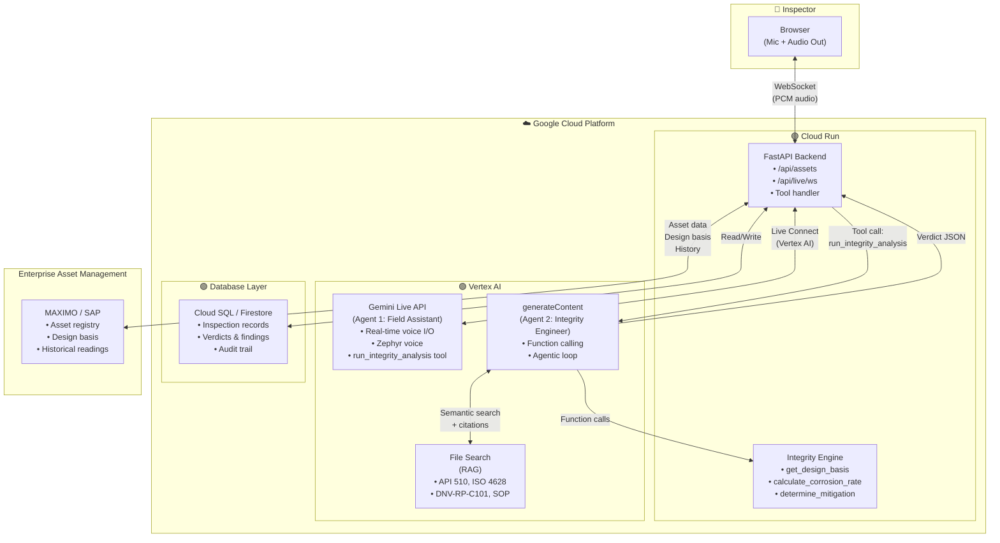

# FieldSight AI — Technical Documentation

This document describes the implementation architecture, components, and APIs for FieldSight AI.

---

## 1. GCP Architecture Diagram

> **Note:** The demo uses in-memory data for simplicity. The architecture below reflects the production design with database and enterprise asset management integration.



**GCP Services Used:**

| GCP Service | Purpose |
|-------------|---------|
| **Cloud Run** | Hosts the FastAPI backend + React SPA as a single serverless service |
| **Vertex AI** | Gemini Live API (Agent 1), generateContent (Agent 2), and File Search (RAG); uses Application Default Credentials |
| **Cloud SQL / Firestore** | Persists inspection records, verdicts, and audit trail (architecture; demo uses in-memory) |

**External Integrations:**

| System | Purpose |
|--------|---------|
| **MAXIMO / SAP** | Enterprise Asset Management (EAM) — asset registry, design basis, historical thickness readings (architecture; demo uses in-memory `ASSET_REGISTRY`) |

---

## 2. System Overview

FieldSight AI is a multi-agent asset integrity orchestrator that:

1. Accepts voice input from inspectors via a WebSocket-connected browser
2. Runs Agent 1 (Field Assistant) on Gemini Live API to collect inspection metrics
3. Hands off to Agent 2 (Integrity Engineer) when all metrics are collected
4. Agent 2 uses deterministic Python tools + File Search to compute verdicts
5. Returns structured verdicts with citations; Agent 1 reads them aloud

```
┌─────────────────────────────────────────────────────────────────────────────┐
│  Inspector (Browser)                                                        │
│  • Select asset → Start Inspection → Agent page                              │
│  • Mic → 16 kHz PCM → WebSocket                                             │
│  • 24 kHz PCM playback from Live API                                        │
└─────────────────────────────────────────────────────────────────────────────┘
                                    │
                                    ▼
┌─────────────────────────────────────────────────────────────────────────────┐
│  React Frontend (Vite 6, React 19)                                          │
│  • /api/live/ws?assetId=SEP-001-V                                           │
│  • useLiveSession hook: audio capture, WebSocket, activity log              │
│  • CriticalAlertModal, verdict cards, activity timeline                     │
└─────────────────────────────────────────────────────────────────────────────┘
                                    │
                                    ▼
┌─────────────────────────────────────────────────────────────────────────────┐
│  FastAPI Backend                                                             │
│  • GET /api/assets                                                          │
│  • GET /api/health                                                          │
│  • WebSocket /api/live/ws → Gemini Live (Vertex AI)                         │
│  • Tool handler: run_integrity_analysis → Agent 2                           │
└─────────────────────────────────────────────────────────────────────────────┘
                                    │
          ┌─────────────────────────┼─────────────────────────┐
          ▼                         ▼                         ▼
┌──────────────────┐    ┌──────────────────┐    ┌──────────────────┐
│  Agent 1         │    │  Agent 2          │    │  File Search      │
│  Gemini Live API │    │  generateContent  │    │  (RAG)            │
│  Vertex AI       │───▶│  + Function Call  │◀───│  Standards store  │
│  Zephyr voice    │    │  Agentic loop     │    │  API 510, ISO,    │
│                  │    │                  │    │  DNV, SOP         │
└──────────────────┘    └──────────────────┘    └──────────────────┘
```

---

## 3. Project Structure

```
fieldsightai/
├── src/                          # React frontend
│   ├── components/               # AgentCenter, Sidebar, Header, ReviewQueue, CriticalAlertModal
│   ├── hooks/useLiveSession.ts   # WebSocket + audio orchestration
│   ├── layouts/AppLayout.tsx
│   ├── pages/                    # InspectionPage, AgentPage, HistoryPage, AssetsPage, SettingsPage
│   ├── utils/audio.ts            # PCM sample rates (16 kHz in, 24 kHz out), base64 helpers
│   └── constants.ts              # Types, tool declarations
├── backend/
│   ├── app/
│   │   ├── main.py               # FastAPI app, routes, WebSocket handler
│   │   ├── config.py             # Env vars (GEMINI_API_KEY, GOOGLE_CLOUD_*, etc.)
│   │   ├── agents/integrity_engineer.py   # Agent 2
│   │   ├── live/                 # Gemini Live integration
│   │   │   ├── gemini_live.py    # Vertex AI Live session proxy
│   │   │   └── prompts.py        # Agent 1 system instruction + tools
│   │   ├── integrity/            # Deterministic tools + data
│   │   │   ├── engine.py         # 5 Python tool functions
│   │   │   ├── assets.py         # ASSET_REGISTRY, HISTORICAL_READINGS
│   │   │   └── standards.py      # MITIGATION_TABLE, is_sour_service
│   │   └── rag/
│   │       └── store_manager.py  # File Search store CRUD
│   ├── data/standards/           # API 510, ISO 4628, DNV-RP-C101, company SOP (.txt)
│   └── scripts/seed_stores.py    # One-time File Search seeding
├── scripts/
│   ├── dev.sh                    # Start backend + frontend
│   ├── install.sh                # Install deps
│   └── deploy.gcp.sh            # Cloud Run deployment
└── .env.example, .env.local
```

---

## 4. Multi-Agent Architecture

### Agent 1: Field Assistant (Gemini Live API)

| Property | Value |
|----------|-------|
| **Model** | `gemini-live-2.5-flash-native-audio` (configurable via `LIVE_MODEL`) |
| **Platform** | Vertex AI (requires `GOOGLE_CLOUD_PROJECT`, `GOOGLE_CLOUD_LOCATION`) |
| **Auth** | Application Default Credentials (`gcloud auth application-default login`) |
| **Voice** | Zephyr (prebuilt) |
| **Modality** | AUDIO (real-time voice I/O) |

**Workflow:**
1. Speaks first on session start — welcomes inspector, confirms asset/location
2. Collects metrics one at a time: UT thickness (avg/min), pitting, coating grade (1–5), cracks
3. Says handoff phrase, then calls `run_integrity_analysis` with collected params
4. Receives verdict from backend; reads it aloud in plain language
5. Asks if inspector wants to move to next point or double-check

**Tool:** `run_integrity_analysis` — params: `asset_id`, `location`, `avg_thickness`, `min_thickness`, `max_pit_depth`, `coating_grade`, `has_cracks`, `service_fluid` (optional, from asset context)

### Agent 2: Integrity Engineer (Gemini generateContent)

| Property | Value |
|----------|-------|
| **Model** | `gemini-2.5-flash` |
| **Platform** | Vertex AI |
| **Auth** | Application Default Credentials |
| **Mode** | Agentic loop with function calling + File Search |

**Workflow:**
1. Receives inspection data from Agent 1 tool call
2. Calls `get_design_basis(asset_id)` → design specs
3. Calls `get_historical_thickness(asset_id)` → previous readings
4. Calls `calculate_corrosion_rate(t_prev, t_curr, delta_t)` → mm/year
5. Calls `calculate_remaining_life(t_curr, t_min, corrosion_rate)` → years
6. Calls `determine_mitigation(defect_type, category, environment)` → prescribed action
7. Uses File Search API for standard citations
8. Returns structured JSON verdict

**Category Logic:**
- **A (Critical):** cracks, thickness below t_min, or remaining life < 0
- **B (Warning):** pitting > corrosion allowance, coating grade ≥ 4, or sour service with significant pitting
- **C (Monitor):** coating grade 3 or minor pitting in non-sour service
- **Normal:** all metrics within limits

---

## 5. Deterministic Integrity Tools

All math and safety-critical logic is implemented in Python. The LLM never computes numbers.

| Function | Purpose |
|----------|---------|
| `get_design_basis(asset_id)` | Design specs (t_min_mm, corrosion_allowance_mm, material, service_fluid) from `ASSET_REGISTRY` |
| `get_historical_thickness(asset_id)` | Previous readings + delta_years from `HISTORICAL_READINGS` |
| `calculate_corrosion_rate(t_prev, t_curr, delta_t)` | Corrosion rate in mm/year |
| `calculate_remaining_life(t_curr, t_min, corrosion_rate)` | Remaining life in years (negative = exceeded) |
| `determine_mitigation(defect_type, category, environment)` | Lookup from `MITIGATION_TABLE` (API 510, ISO 4628, DNV); applies sour-service modifier when `is_sour_service(environment)` |

**Defect types:** `wall_thinning`, `pitting`, `coating_failure`, `cracking`, `sour_service`

---

## 6. RAG Engine (File Search)

| Property | Value |
|----------|-------|
| **API** | Gemini File Search API |
| **Store** | Created/retrieved by `FILE_SEARCH_STORE_NAME` (default: `fieldsight-standards`) |
| **Seeding** | `python -m backend.scripts.seed_stores` |

**Indexed documents:**
- `api_510_pressure_vessel_inspection.txt`
- `iso_4628_coating_assessment.txt`
- `dnv_rp_c101_corrosion_protection.txt`
- `company_sop_fpso_inspection.txt`

**Integration:** Agent 2 uses a single `Tool` with both `function_declarations` and `file_search`. File Search returns grounding metadata and citations; these are parsed from `grounding_metadata.grounding_chunks` and attached to the verdict.

---

## 7. API Endpoints

| Method | Path | Description |
|--------|------|-------------|
| GET | `/api/health` | Health check |
| GET | `/api/assets` | List assets from `ASSET_REGISTRY` |
| WebSocket | `/api/live/ws?assetId=<id>` | Gemini Live session; requires valid `assetId` |

**WebSocket protocol:**
- Client sends: binary PCM (16 kHz, 16-bit) or JSON `{ type: "image", data: base64 }` for optional image
- Server sends: binary PCM (24 kHz) for audio, JSON events for tool calls, verdicts, status

---

## 8. Configuration

| Variable | Required | Description |
|----------|----------|-------------|
| `GEMINI_API_KEY` | Yes | API key for Agent 2 + File Search |
| `GOOGLE_CLOUD_PROJECT` | Yes (for Live) | GCP project ID for Vertex AI |
| `GOOGLE_CLOUD_LOCATION` | Yes (for Live) | e.g. `us-central1` |
| `FILE_SEARCH_STORE_NAME` | No | Display name of File Search store (default: `fieldsight-standards`) |
| `LIVE_MODEL` | No | Live model name (default: `gemini-live-2.5-flash-native-audio`) |
| `LIVE_SESSION_TIMEOUT_SECONDS` | No | Session timeout (default: 180) |

---

## 9. Deployment

**Local:**
```bash
./scripts/dev.sh
# Backend: port 8000
# Frontend: port 3000 (Vite proxy /api → backend)
```

**Cloud Run:**
```bash
PROJECT_ID=your-project REGION=us-central1 SERVICE_NAME=fieldsight-ai ./scripts/deploy.gcp.sh
```
- Builds frontend, copies `dist/` into `backend/dist`
- Deploys backend as Cloud Run service
- Serves SPA + API from same URL

---

## 10. Verdict Schema

```json
{
  "category": "A" | "B" | "C" | "Normal",
  "verdict": "Plain-language engineering verdict",
  "action": "Prescribed maintenance action",
  "standard_cited": "Specific standard section reference",
  "corrosion_rate_mm_per_year": number,
  "remaining_life_years": number | null,
  "calculations": { ... },
  "citations": [{ "title": "...", "uri": "..." }],
  "asset_id": "...",
  "location": "...",
  "avg_thickness": number,
  "min_thickness": number,
  "max_pit_depth": number,
  "coating_condition": "Grade N",
  "has_cracks": boolean,
  "service_fluid": "..."
}
```

---

## 11. Data Sources

**Demo (current implementation):**
- **ASSET_REGISTRY** — In-memory dict in `backend/app/integrity/assets.py`. Contains design basis for each asset.
- **HISTORICAL_READINGS** — In-memory dict. Previous thickness, pit depth, coating grade, delta_years.
- **MITIGATION_TABLE** — In `backend/app/integrity/standards.py`. Lookup table by defect type and category.
- No database; all state is in-memory.

**Architecture (production design):**
- **Database (Cloud SQL / Firestore)** — Inspection records, verdicts, findings, audit trail.
- **MAXIMO / SAP** — Enterprise Asset Management (EAM) for asset registry, design basis, and historical readings. The Integrity Engine's `get_design_basis` and `get_historical_thickness` tools would call MAXIMO/SAP APIs instead of in-memory dicts.
