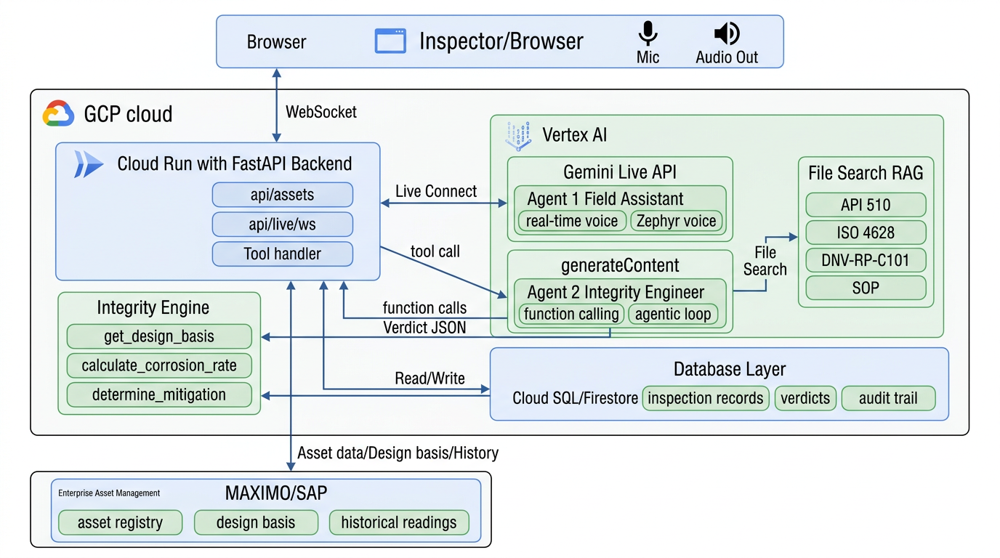
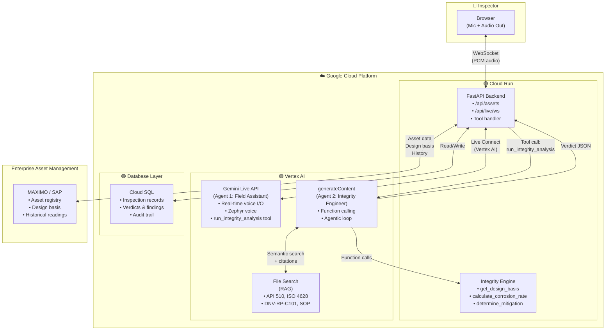

# FieldSight AI — GCP Architecture Diagram

This diagram highlights the Google Cloud Platform (GCP) services used by FieldSight AI.

> **Note:** The demo uses in-memory data for simplicity. The architecture below reflects the production design with database and MAXIMO/SAP integration.

> **Tip:** The Mermaid source below can be rendered in [Mermaid Live Editor](https://mermaid.live), GitHub, or any Markdown viewer that supports Mermaid.

## GCP Services Summary

| GCP Service | Purpose |
|-------------|---------|
| **Cloud Run** | Hosts the FastAPI backend + React SPA as a single serverless service |
| **Vertex AI** | Gemini Live API (Agent 1), generateContent (Agent 2), and File Search (RAG); uses Application Default Credentials |
| **Cloud SQL / Firestore** | Persists inspection records, verdicts, and audit trail (architecture; demo uses in-memory) |

## External Integrations

| System | Purpose |
|--------|---------|
| **MAXIMO / SAP** | Enterprise Asset Management (EAM) — asset registry, design basis, historical thickness readings (architecture; demo uses in-memory `ASSET_REGISTRY`) |

## Data Flow

1. **Inspector** → Browser captures mic audio (16 kHz PCM) → WebSocket to backend
2. **FastAPI** (Cloud Run) → Proxies to **Vertex AI** Gemini Live → Agent 1 speaks and listens
3. **Agent 1** calls `run_integrity_analysis` → **FastAPI** invokes **Agent 2** (Vertex AI)
4. **Agent 2** → Calls integrity tools (Python) + File Search (RAG) → Returns verdict
5. **FastAPI** (Cloud Run) → Fetches asset data (design basis, history) from **MAXIMO/SAP**
6. **FastAPI** → Persists verdicts and inspection records to **Database**
7. **Verdict** → Back to Agent 1 → Spoken aloud + displayed in UI
