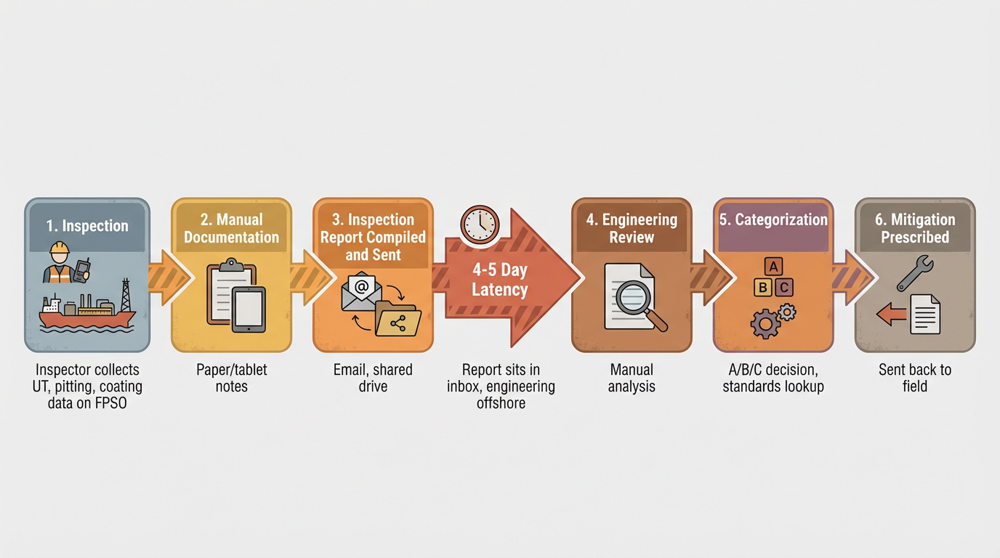
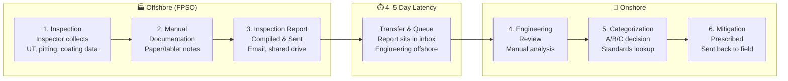

# Current Problem — Inspection-to-Decision Flow

This diagram illustrates the **traditional flow** that creates the 4–5 day latency between field observations and engineering decisions.





## The Integrity Gap

| Step | What Happens | Problem |
|------|--------------|---------|
| **1. Inspection** | Inspector collects UT thickness, pitting, coating grade, crack data on FPSO | Data captured but not yet actionable |
| **2. Manual Documentation** | Notes on paper or tablet; photos; spreadsheets | Prone to errors, incomplete context |
| **3. Inspection Report Sent** | Report compiled, emailed or uploaded to shared drive | Batched; no real-time handoff |
| **4–5 Day Latency** | Report waits in queue; engineering team is onshore | Critical defects may go unaddressed for days |
| **4. Engineering Review** | Engineer manually reviews report, pulls design basis, historical data | 120+ hours of manual review cycle |
| **5. Categorization** | Engineer determines A/B/C, cites standards (API 510, ISO 4628) | Delayed decision; inspector already moved on |
| **6. Mitigation Prescribed** | Action sent back to field; inspector may need to return to location | Reactive; safety risk in high-stakes environments |

## FieldSight AI Solution

FieldSight AI collapses this flow into a **~5-minute digital handshake**:

```
Inspection → Voice-guided data collection → run_integrity_analysis → Verdict + Prescription (real-time)
```

The inspector receives the engineering verdict and prescribed mitigation **at the point of inspection**, with no handoff delay.
